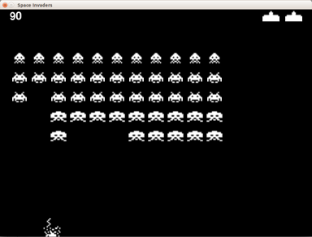

# Solo 3 Cannoni

Il gioco è ormai completo, manca l'interruzione del gioco se il cannone viene colpito 3 volte. Procediamo così:

1. Impostare il numero massimo di cannoni a 3 e diminuirli ogni volta che viene colpito
2. Quando il numero di cannoni è zero **GAME OVER**
3. Disegniamo in alto a destra i cannoni che abbiamo ancora
4. Facciamo un bell'effetto scoppio con animazione e suono

## Cannone Colpito

Dobbiamo segnare il numero massimo di cannoni e diminuirli di uno tutte le volte che il cannone viene colpito.:

```python
CANNONI_INIZIALI = 3
...
cannoni = CANNONI_INIZIALI
...
cannoni = cannoni - 1
print("CANNONE COLPITO. Rimasti " + str(cannoni))
```

* Il primo lo mettiamo in alto insieme alle altre costanti
* La seconda nell'inizializzazione
* il terzo gruppo lo mettiamo al posto di nella logica al posto di `print("CANNONE COLPITO")`

## GAME OVER

Il nostro ciclo main di `pygame` viene eseguito solo se `invaso` è falso... Dobbiamo verificare anche che ci siano 
ancora cannoni, altrimenti anche in questo caso la partita è finita.

Basta sostituire `while not invaso:` con

```python
while not invaso and cannoni > 0:
```

## Disegniamo i cannoni a disposizione

Per disegniare i cannoni dobbiamo costruire un rettangolo nuovo da spostare in alto e riempirlo con l'immagine del 
cannone. Con il nuovo rettangolo lo posizioniamo in alto a destra e disegniamo un cannone spostandoci a sinistra fino
a che non disegniamo gli `cannoni - 1` da fare:

```python
cannone_extra_rettangolo = cannone_rettangolo.copy()
for i in range(cannoni - 1):
    cannone_extra_rettangolo.topright = LARGHEZZA - 30 - 70 * i, 5
    schermo.blit(cannone_immagine, cannone_extra_rettangolo)
```

Tutto questo nella zona dei disegni.

## BOOM!

Per lo scoppio carichiamo 2 immagini e un suono nelle inizializzazioni:
```python
cannone_boom_immagini = pygame.image.load("esplosione_1.png"), pygame.image.load("esplosione_2.png")
...
boom = pygame.mixer.Sound('boom.wav')
boom.set_volume(1)
```

E dove abbiamo riconosciuto che l'astronave viene colpita mettiamo:

```python
boom.play()
for i in range(4):
    for j in range(2):
        pygame.draw.rect(schermo, NERO, cannone_rettangolo)
        schermo.blit(cannone_boom_immagini[j], cannone_rettangolo)
        pygame.display.flip()
        orologio.tick(3)
```

Dove prima avevamo scritto `print("CANNONE COLPITO. Rimasti " + str(cannoni))`. Questa parte del programma per 4 volte
cambia le due immagini di scoppio e disegnandole sopra un rettangolo nero al posto del cannone. Per fare questo imposta
solo 3 immagini al secondo per non farlo troppo veloe.

Notate the mentre facciamo questo **Tutto si ferma a aspettare** ... **Perché?**

## Abbiamo Finito?

Non è detto... Forse qualcuno avrà un **bug** da risolvere: **quando il cannone viene colpito l'esplosione non sembra 
ben centrata sul cannone**.

Per risoverlo fatevi questa domanda: **Quando disegno l'esplosione il rettangolo è proprio dove è il cannone?**.

Controllate quindi **quando nel programma** spostate il cannone e vedete se riuscite a fare diversamente.

## Fine



[Questo](src/pyinvaders.py) è il risultato. Buon diverimento

* Precedente: [Conteggio punti e alieni che sparano](punti_spari.md)
