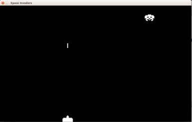

# Un Alieno

Ora vogliamo inserire il primo alieno, animarlo e farlo muovere per lo schermo. Per fare questo dovremo

1. Caricare le immagini dell'alieno e costruire il rettangolo
2. Fissare una posizione di partenza del rettangolo e disegnarci l'immagine dell'alieno
3. A intervalli regolari cambiare l'immagine dell'amieno da disegnare
3. Cambiare la posizione dell'alieno quando serve per andare a destra, sinistra o in basso

## Caricare le immagini dell'alieno

Come potete vedere ci sono 3 tipi di alieni e per ogni alieno ci sono 2 immagini. I nomi delle immagini le trovate nella
directory del progetto e sono del tipo `alieno_?_?.png` dove nel primo punto interrogativo troviamo il numero 
dell' alieno e nel secondo il tipo di immagine (1 o 2). Per ora vogliamo usare solo alieno 1 eper caricare le due 
immagini e costruire il rettangolo possiamo usare:

```python
alieno_1_immagine_1 = pygame.image.load("alieno_1_1.png")
alieno_1_immagine_2 = pygame.image.load("alieno_1_2.png")
alieno_rettangolo = alieno_1_immagine_1.get_rect()
```

Il rettangolo si costruisce usando una delle due immagini (tanto sono grandi uguali).


Le cose iniziano a essere un po complicate e tutti questi numerini sono noisi... è ora di imparare qualcosa di nuovo!

Aprite la console e scrivete 

```python
>>> numeri = 1,2, 3, 7,10
>>> numeri
(1, 2, 3, 7, 10)
>>> numeri[2]
3
>>> numeri[4]
10
>>> numeri[0]
1
>>> for n in numeri:
...     print(n)
... 
1
2
3
7
10
```

Dentro a `numeri` abbiamo messo un tanti numeri diversi e abbiamo potuto prendere quello che ci serviva 
semplicemente scrivendo `numeri[posizione]` inoltre con il ciclo for possiamo girarli tutti semplicemente.

Quindi possiamo invece di usare due nomi per le immagini dell' alieno possiamo usare un nome solo che contiene entrambe
le immagini:

```python
alieno_1_immagine = pygame.image.load("alieno_1_1.png"), pygame.image.load("alieno_1_2.png")
alieno_1_rettangolo = alieno_1_immagine[0].get_rect()
```

## Disegnamo l'alieno al centro in alto

Per prima cosa posizioniamo l'alieno e disegniamolo sullo schermo usando la prima immagine caricata. Per ora possiamo 
mettere l'alieno a 30 pixels dal soffitto e al centro dello schermo :

```python
alieno_1_rettangolo.center = larghezza/2, 30
schermo.blit(alieno_1_immagine[0], alieno_1_rettangolo)
```

## Animiamolo cambiando le due immagini da disegnare

Ora vogliamo creare una animazione dell'alieno, dobbiamo alternare le due immagini: chiamiamo `alieno_1_pos_immagine=0`
la posizione (`0` o `1`) dell'immagine che usiamo  e disegniamo l'immagine con il comando

```python
schermo.blit(alieno_1_immagine[alieno_1_pos_immagine], alieno_1_rettangolo)
```

Quindi ora ci basterà cambiare il numero dentro `alieno_1_pos_immagine` per usare l'immagine 0 o quella 1:

```python
alieno_1_pos_immagine = 0
...

alieno_1_pos_immagine = alieno_1_pos_immagine + 1
if alieno_1_pos_immagine > 1:
    alieno_1_pos_immagine = 0
...
schermo.blit(alieno_1_immagine[alieno_1_pos_immagine], alieno_1_rettangolo)
```

**Si muove!!!** Ma troppo velocemente. Dobbiamo trovare una maniera per cambiare l'mmagine solo *ogni tanto e non ogni
volta che disegniamo un frame*.

Ci sono tantissime maniere per farlo, ma quella più utile per altre cose è di dire a `pygame` di avvertirci a intervalli
regolari in maniera che possiamo coordinare il nostro lavoro.

Per fare questo si definisce un nuovo evento con un numero e si istruisce `pygame` a comunicarci l'evento con il comando

```python
pygame.time.set_timer(<numero_event>, <intervallo_in_millisecondi>)
```

per cui dobbiamo inserire queste righe:

```python
MUOVI_ALIENI_EVENTO = pygame.USEREVENT + 1
...
pygame.time.set_timer(MUOVI_ALIENI_EVENTO, 500)
...
if evento.type == MUOVI_ALIENI_EVENTO:
    alieno_1_pos_immagine = alieno_1_pos_immagine + 1
    if alieno_1_pos_immagine > 1:
        alieno_1_pos_immagine = 0
```

Dove 

1. La prima riga la mettiamo in alto dove abbiamo messo tutti i numeri fissi come `VELOCITA_SPARO`
2. La funzione `set_timer()` prima di iniziare il ciclo main di `pygame`
3. Il resto dove guardiamo gli eventi della tastiera ... ricordatevi di togliere il vecchio cambio di immagine

## Muoviamo l'alieno a destra e sinistra

Ogni volta che l'alieno cambia immagine si muove. Si può muovere a destra, a sinistra e in basso:

1. Inizia a muoversi a destra
2. Quando tocca il bordo a destra o a sinistra fa due movimenti in basso e si muove nel verso contrario

Per ora facciamo solo il movimento a destra e sinistra e poi metteremo il movimento in basso. Ogni alieno si muove in un
passo a destra o sinistra di `25` pixels.

Per cui abbiamo un `MOVIMENTO_LATERALE_ALIENO = 25` da mettere all'inizio e muovere il rettangolo dell'alieno ogni volta
che avviene un evento `MUOVI_ALIENI_EVENTO` di `MOVIMENTO_LATERALE_ALIENO` se andiano a destra e 
`-MOVIMENTO_LATERALE_ALIENO` se andiamo a sinistra. Ma facciamo le cose per gradi e muoviamoci solo a destra. Ogni volta
che accade `MUOVI_ALIENI_EVENTO` eseguiamo:

```python
alieno_1_rettangolo.centerx = alieno_1_rettangolo.centerx + MOVIMENTO_LATERALE_ALIENO
```

Quello che succede è che il nostro alieno scompare dallo schermo. Quindi ora invece di usare `MOVIMENTO_LATERALE_ALIENO`
prendiamo un nuovo `movimento_alieno_dx_sx` che sarà uguale a `MOVIMENTO_LATERALE_ALIENO` quando vogliamo andare a 
destra e `-MOVIMENTO_LATERALE_ALIENO` quando invece vogliamo andare a sinistra.

Ora dobbiamo riconoscere solo definire la direzione inziale e capire quando cambiare direzione

```python
movimento_alieno_dx_sx = MOVIMENTO_LATERALE_ALIENO
...
if alieno_1_rettangolo.right + movimento_alieno_dx_sx > larghezza:
    movimento_alieno_dx_sx = -MOVIMENTO_LATERALE_ALIENO
if alieno_1_rettangolo.left + movimento_alieno_dx_sx < 0:
    movimento_alieno_dx_sx = MOVIMENTO_LATERALE_ALIENO
alieno_1_rettangolo.centerx = alieno_1_rettangolo.centerx + movimento_alieno_dx_sx
```

Dove la prima riga va messa prima del ciclo main e il secondo gruppo quando avviene un `MUOVI_ALIENI_EVENTO`.

## Movimento in basso

Ogni volta che l'alieno deve cambiare direzione prima vogliamo fargli fare due moviemnti in basso da 
`MOVIMENTO_GIU_ALIENO = 15`. Per fare questo usiamo un numero `muovi_alieno_giu` che fino a che è maggiore di `0` allora 
l'alieno si muove in basso e questo numero diminuisce di `1`. Quando l'alieno si muove in basso allora:

1. Non cambia direzione
2. Non si muove laterale

Quindi usiamo le sequenti righe:

```python
MOVIMENTO_GIU_ALIENO = 15
...
muovi_alieno_giu = 2
...
if muovi_alieno_giu > 0:
    alieno_1_rettangolo.centery = alieno_1_rettangolo.centery + MOVIMENTO_GIU_ALIENO
    muovi_alieno_giu = muovi_alieno_giu - 1
else:
    alieno_1_rettangolo.centerx = alieno_1_rettangolo.centerx + movimento_alieno_dx_sx
```

Dove la prima riga la mettiamo in alto, la seconda la usiamo per provare (dopo diventerà `0`) e la mettiamo prima del 
ciclo main di `pygame` e il terzo gruppo al posto del vecchio movimento dell'alieno.

Funziona proprio bene: l'alieno si muove due volte giu e poi parte a destra. Ora non ci resta che capire quando 
`muovi_alieno_giu` deve diventare 2. 

**Tutte le volte che l'alieno deve cambiare direzione deve fare due movimenti in basso.** Ma **ATTENZIONE** ... questo
non deve succedere se si sta muovendo già in basso!. Il cambio di direzione diventa:

```python
muovi_alieno_giu = 0
...
if muovi_alieno_giu == 0:
    if alieno_1_rettangolo.right + movimento_alieno_dx_sx > larghezza:
        movimento_alieno_dx_sx = -MOVIMENTO_LATERALE_ALIENO
        muovi_alieno_giu = 2
    if alieno_1_rettangolo.left + movimento_alieno_dx_sx < 0:
        movimento_alieno_dx_sx = MOVIMENTO_LATERALE_ALIENO
        muovi_alieno_giu = 2
```

## Dove siamo adesso



Ecco come si presenta ora il [gioco](src/alieno.py). L'alieno si muove *elegantemente* e noi possiamo cercare di colpirlo
con i nostri spari... ma non succede niente.

* Prossimo: [Colpisci l'alieno e preparati all'invasione con due alieni](alieno_colpito.md)
* Precedente: [Muoviamo e Spariamo](muovi.md)