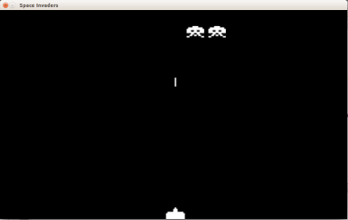

# Colpisci l'alieno e preparati all'invasione con due alieni

Ora abbiamo un cannone che muoviamo e un alieno che si muove da solo. Il nostro cannone può sparare, ma anche se
colpisce l'alienon non succede nulla.

Quello che vogliamo riuscire a fare è 

1. Fermare lo sparo e farlo sparire quando colpisce l'alieno
2. Emettere un suono quando l'alieno viene colpito
3. Cambiare il programma per poter fare tanti alieni
4. Aggiungere un alieno
5. L'alieno colpito sparisce


## Riconosce che lo sparo colpisce l'alieno

Per controllare se due rettangoli si scontrano `pygame` ci fornisce la funzione `colliderect()`. In pratica se 
`alieno_1_rettangolo.colliderect(sparo_rettamgolo)` è vero allora lo sparo ha colipto l'alieno.
 
Quindi ora semplicamente facciamo stampare una scritta quando lo sparo colpisce l'alieno usando:
 
```python
if alieno_1_rettangolo.colliderect(sparo_rettamgolo):
    print("COLPITO")
```

Nella mia console ho letto
```
COLPITO
COLPITO
COLPITO
COLPITO
COLPITO
```

anche quando ho colpito l'alieno solo una volta: questo perchè i due rettangoli si sono incrociati per 5 fotogrammi.

Quindi per far sparire lo sparo usiamo `sparo_in_volo = False` e il controllo lo facciamo solo quando lo sparo sta 
volando: Sostituiamo il vecchio controllo dello sparo con 

```python
if sparo_in_volo:
    sparo_rettamgolo.top = sparo_rettamgolo.top - VELOCITA_SPARO
    if sparo_rettamgolo.bottom < 0:
        sparo_in_volo = False
    if alieno_1_rettangolo.colliderect(sparo_rettamgolo):
        sparo_in_volo = False
```

## BANG!

Colpiamo l'alieno e sentiamo bang! Per sentire bang bisogna caricare il suono con 
`bang = pygame.mixer.Sound('bang.wav')` e impostare il volume con `bang.set_volume(0.2)`, adesso tutte le 
volte che colpiamo l'alieno usiamo la funzione `bang.play()` per suonarlo:

```python
bang = pygame.mixer.Sound('bang.wav')
bang.set_volume(1)
...
bang.play()
```
 
Dove il primo pezzo lo facciamo una volta per tutte prima del ciclo main e `bang.play()` tutte le volte che lo sparo 
colpisce l'alieno.

## Un po di ordine

Ora nel nostro gioco ci devono essere tanti alieni e se guardiamo come è scritto adesso per ogni alieno dobbiamo
fare tanti altri nomi nuovi come `alieno_1_immagine`, `alieno_1_rettangolo` e `alieno_1_pos_immagine`. Magari possiamo
provare a farne tanti altri, ma diventa un lavoro lungo e noioso.

Se leggiamo bene i nomi possiamo dire che `immagine`, `rettangolo` e `pos_immagine` sono tutti *attributi* dell'alieno.
In *Python* esiste una cosa molto semplice per contenere le cose usando dei nomi e si chiama **dizzionario**.

### Dizzionario

Lasciamo per un attimo da parte il nostro programma e cerchiamo di capire questo concetto. I dizzionari di Python 
assomigliano molto ai dizzionari normali: si scrive sul dizzionario che una una parola ( *stringa* ) ha un significato
e tutte le volte che si vuole leggere il significato basta aprire il dizzionario e leggerlo.

Vediamo come funzionano:

Per crearli si usano le parentesi graffe `{}` e gli elementi si definiscono come `voce: valore`.

```python
>>> alieno_1 = {"numero braccia": 4, "numero gambe": 3, "lingua parlata": "marziano"}
>>> alieno_2 = {"numero braccia": 1, "numero gambe": 127, "lingua parlata": "giovese="}
>>> print(alieno_1)
{'numero gambe': 3, 'numero braccia': 4, 'lingua parlata': 'marziano'}
>>> print(alieno_2)
{'numero gambe': 127, 'numero braccia': 1, 'lingua parlata': 'giovese='}
```

E' possibile accedere alle singole voci usando le parentesi quadre `[]` e mettendo la voce che ci interessa

```python
>>> print(alieno_1["lingua parlata"])
marziano
```

E' possiabile anche aggiungere nuove voci ai dizzionari o modificare quelle esistenti:

```python
>>> alieno_2["aggressivo"] = "no"
>>> alieno_1["aggressivo"] = "si"
>>> print(alieno_1)
{'numero gambe': 3, 'numero braccia': 4, 'lingua parlata': 'marziano', 'aggressivo': 'si'}
>>> print(alieno_2)
{'numero gambe': 127, 'numero braccia': 1, 'lingua parlata': 'giovese=', 'aggressivo': 'no'}
>>> alieno_2["numero gambe"] = 113
>>> print(alieno_2)
{'numero gambe': 113, 'numero braccia': 1, 'lingua parlata': 'giovese=', 'aggressivo': 'no'}
```

### `alieno_1_rettangolo` come attributo `"rettangolo"` di `alieno`

Facciamo un nuovo dizzionario chiamato `alieno` che contiene la voce `"rettangolo"`. Questa voce rettangolo la useremo 
al posto `alieno_1_rettangolo`. Quindi al posto di `alieno_1_rettangolo = alieno_1_immagine[0].get_rect()` scriviamo

```python
alieno = {}
alieno["rettangolo"] = alieno_1_immagine[0].get_rect()
```

Ora in tutto il programma al posto di `alieno_1_rettangolo` sostituite `alieno["rettangolo"]`... Potete farvi aiutare 
trova/sostituisci (*Find/Replace*) che trovate sopra a dove scrivete il programma.


### Un solo `alieno` con tanti attributi

Ora sostituiamo anche il resto:

* `alieno_1_immagine` -> `alieno["immagini"]`
* `alieno_1_pos_immagine` -> `alieno["pos_immagine"]`

Ora il vostro gioco funziona uguale a prima, ma tutte le volte che dovete fare qualcosa sull'alieno usate solo il 
dizzionario `alieno` e non più tre parole diverse.

## Due alieni

Per fare più di un alieno abbiamo bisogno di un contenitore per metterli dentro. Per queste cose *Python* definisce uno
strumento semplice: la lista.

### La Lista

La lista è un contenitore simi al dizzionario, ma dove le cose non si trovano in base al loro nome, ma in base alla loro
posizione. Sulle liste è possibile aggiungere e togliere elementi e fare *la stessa cosa per ogni elemento*.

Vediamo come funzionano:

Per crearle si usano le parentesi quadre `[]` e gli elementi sono separati da virgola.

```python
>>> alieni = [alieno_1, alieno_2]
>>> print(alieni)
[{'numero gambe': 3, 'numero braccia': 4, 'lingua parlata': 'marziano', 'aggressivo': 'si'}, {'numero gambe': 127, 'numero braccia': 1, 'lingua parlata': 'giovese=', 'aggressivo': 'no'}]
```

Si possono aggiungere elementi in fondo o all'inizio o in mezzo... ma anche toglierli:
```python
>>> numeri=[3, 4, 5]
>>> print(numeri)
[3, 4, 5]
>>> numeri.append(120)
>>> print(numeri)
[3, 4, 5, 120]
>>> numeri.insert(0, 70)
>>> print(numeri)
[70, 3, 4, 5, 120]
>>> numeri.insert(2, 170)
>>> print(numeri)
[70, 3, 170, 4, 5, 120]
>>> numeri.remove(4)
>>> print(numeri)
[70, 3, 170, 5, 120]
```

e fare la stessa cosa per ogni elemento:

```python
>>> for n in numeri:
...     print(n)
... 
70
3
170
5
120
```

... Ci fermiamo quì, ma si possono fare tante altre cose.

### Una lista di `alieni`

Benue ora prima di costruire il nostro nuovo alieno facciamo una lista di alieni con il comando

```python
alieni = []
```

Dopo troviamo `alieno = {}` e tutti gli attributi dell'alieno. Quando tutti gli attributi sono completi potete usare
`alieni.append(alieno)`.

Ora il problema è che questo nome alieno viene usato nel resto del programma senza cambiare mai, invece ogni volta che 
vogliamo usare un alieno vogliamo farlo per ogni alieno nella lista degli `alieni`.

Il mio consiglio è di cambiare nome dove costruite alieno per esempio usando:

```python
nuovo_alieno = {}
nuovo_alieno["immagini"] = pygame.image.load("alieno_1_1.png"), pygame.image.load("alieno_1_2.png")
nuovo_alieno["rettangolo"] = nuovo_alieno["immagini"][0].get_rect()
nuovo_alieno["pos_immagine"] = 0
nuovo_alieno["rettangolo"].center = LARGHEZZA/2, 30
alieni.append(nuovo_alieno)
```

Adesso tutte le volte che usate ancora `alieno` verrà segnato un errore: in questi posti quello che volete fare è farlo
per tutti gli alieni con `for alieno in alieni:`. Per esempio dove si quarda l'evento `MUOVI_ALIENI_EVENTO` diventerà:

```python
for alieno in alieni:
    alieno["pos_immagine"] = alieno["pos_immagine"] + 1
    if alieno["pos_immagine"] > 1:
        alieno["pos_immagine"] = 0
    if muovi_alieno_giu == 0:
        if alieno["rettangolo"].right + movimento_alieno_dx_sx > larghezza:
            movimento_alieno_dx_sx = -MOVIMENTO_LATERALE_ALIENO
            muovi_alieno_giu = 2
        if alieno["rettangolo"].left + movimento_alieno_dx_sx < 0:
            movimento_alieno_dx_sx = MOVIMENTO_LATERALE_ALIENO
            muovi_alieno_giu = 2
if muovi_alieno_giu > 0:
    for alieno in alieni:
        alieno["rettangolo"].centery = alieno["rettangolo"].centery + MOVIMENTO_GIU_ALIENO
    muovi_alieno_giu = muovi_alieno_giu - 1
else:
    for alieno in alieni:
        alieno["rettangolo"].centerx = alieno["rettangolo"].centerx + movimento_alieno_dx_sx
```

Noterete che si deve usere `for alieno in alieni:` ben tre volte: la prima quando si cambia immagine e si controlla se
qualche alieno tocca il bordo, la seconda per quando si muove in basso e la terza per i movimenti laterali. Potete 
sperimentare altre maniere di fare queste operazioni e fatevi aiutare dal vostro mentor per capire quello che sta
succedendo.

Gli altri punti da cambiare sono:

* Dove controlliamo se lo sparo ha colpito l'alieno
* Dove disegniamo gli alieni

### Il secondo alieno

Forse lo avete già capito: per aggiungere il secondo alieno basta farne uno nuovo e aggiungerlo alla lista. Dopo aver 
appeso il primo alieno alla lista mettete il secondo:

```python
nuovo_alieno = {}
nuovo_alieno["immagini"] = pygame.image.load("alieno_1_1.png"), pygame.image.load("alieno_1_2.png")
nuovo_alieno["rettangolo"] = nuovo_alieno["immagini"][0].get_rect()
nuovo_alieno["pos_immagine"] = 0
nuovo_alieno["rettangolo"].center = LARGHEZZA/2 + 60, 30
alieni.append(nuovo_alieno)
```

... Uguale al primo ma in una posizione diversa spostata di 50 pixels: 
`nuovo_alieno["rettangolo"].center = LARGHEZZA/2 + 60, 30`

Adesso sono comparsi due alieni e quando uno dei due tocca il bordo scendono e si muovono dall'altra parte.

## L'alieno colpito sparisce

Basta che quando lo sparo colpisce l'alieno lo rimuove dalla lista con:

```python
alieni.remove(alieno)
```


## Dove siamo adesso



Inizia a essere un [programmino](src/alieno_colpito.py) complesso. I due alieni si muovono coordinati e quando li 
colpiamo spariscono oltre a fare rumore.

* Prossimo: [L'invasione](invasione.md)
* Precedente: [Un Alieno](alieno.md)