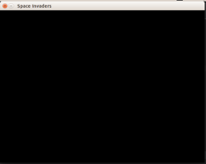
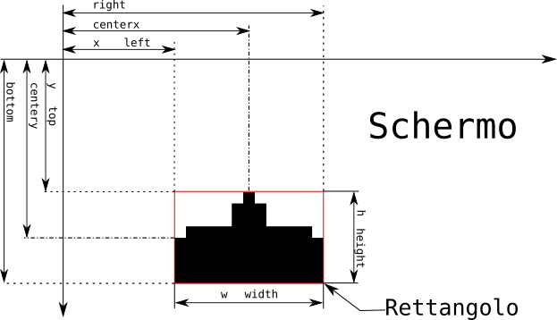

# Sfondo, musica e il nostro cannone

Eccoci davanti al foglo bianco, vediamo di rimepirlo. Vogliamo fare una bella finestra che resta aperta fino a quando 
non la chiudiamo con il nostro cannone fermo in basso al centro e una musica di sottofondo.

## Una bella finestra nera

Per prima cosa creiamo semplicemente il campo di gioco che consiste in una finestra nera dal nome *Space Invaders* 
larga 960 pixels (punti) e alta 580.

```python
ALTEZZA = 700
LARGHEZZA = 960
DIMENSIONI_SCHERMO = LARGHEZZA, ALTEZZA
NERO = 0, 0, 0

pygame.init()

pygame.display.set_caption('Space Invaders')

schermo = pygame.display.set_mode(DIMENSIONI_SCHERMO)
schermo.fill(nero)
pygame.display.flip()
```

Ora provimo a farlo partire e vediamo cosa succede.... Ecco una bella finestra vuota e nera:



... che si chiude subito :(

Poco male dato che è ora di scoprire cosè il **ciclo main di pygame**.

## Il ciclo main di `pygame`

Quando si esegue un gioco con `pygame` é come se ci fosse un direttore di orchestra che detta il tempo: *tutte le 
volte che il direttore di orchestra muove la bacchetta, bisogna eseguire i propri compiti e aspettare il prossimo 
movimento*.

Per costruire questo direttore di orchestra bisogna chiedere a `pygame` un *oroglogio* che ci aiuterà ad aspettare con
precisione il prossimo colpo di bacchetta.

```python
orologio = pygame.time.Clock()
while True:
    # Chiediamo all'orologio di aspettare fino al prossimo colpo di 
    # bacchetta e di fare 30 colpi di bacchetta al secondo
    orologio.tick(30)
    Il lavoro da fare prima di aspettare il prossimo tocco
```

Questi colpi si chiamano **frame** (fotogrammi), come in un film noi disegnamo tante foto da mostrare una dopo l'altra
con un ritmo di 30 al secondo. Quindi in ogni **frame** dobbiamo ridisegnare il nostro schermo:

```python
FPS = 30

orologio = pygame.time.Clock()
while True:
    orologio.tick(FPS)
    schermo.fill(nero)
    pygame.display.flip()
```    

Ed ecco che la nostra finestra non si chiude più... ma proprio più :). Provate con il quadrato rosso in basso a sinistra
che dovrebbe uccidere il programma. Ho chiamato `FPS` il numerp di colpti di bacchetta ( **F**rames **P**er **S**econds)

## Comunicare con un programma pygame

Per capire cosa sta facendo il giocatore, i programmi `pygame` devono *ascoltare e reagire a quello che succede*. Quello
che succede sono pressione di tasti, movimenti del mouse, click ... richieste di chiusura della finestra. Siamo noi che
dobbiamo istruire il nostro gioco a fare la cosa giusta quando succede qualcosa.

Quindi ora diremo che quando qualcuno vuole chiudere il programma bisogna uscire. Per fare questo bisogna analizzare 
tutti gli eventi che arrivano e se troviamo una richiesta di uscita uscire:

Quindi, prima di disegnare ogni frame scriviamo

```python
for evento in pygame.event.get():
    if evento.type == pygame.QUIT:
        import sys
        sys.exit()
```

Cioè per ogni **evento** che è successo si verifica se l'evento è una richiesta di uscita `pygame.QUIT`

Quindi adesso il vostro gioco si chiude quando cercate di chiudere la finestra.

## Disegnamo il cannone in basso al centro

Per disegnare il cannone bisogna leggere l'immagine del cannone, costruire un rettangolo grande come l'immagine e
tutte le volte che vorremo disegnare il cannone posizioniamo il rettangolo sullo schermo e diciamo allo schermo di
riempire il rettangolo l'immagine. Troppe parole: facciamo spazio al codice:

```python
cannone_immagine = pygame.image.load("cannone.png")
cannone_rettamgolo = cannone_immagine.get_rect()
cannone_rettamgolo.centerx = LARGHEZZA / 2
cannone_rettamgolo.bottom = ALTEZZA

...
   # Prima di riempire il display
   schermo.blit(cannone_immagine, cannone_rettamgolo)
```

Per capire come si posizionano i rettangoli usate questo schema:



Ci sono anche altre proprietà del rettangolo, ma quelle segnate nel disegno bastano e avanzano per iniziare. Comunque
questo è il valore che hanno tutti gli attributi del rettangolo dopo averlo posizionato in basso al centro:

```
cannone_rettamgolo.x : 454
cannone_rettamgolo.y : 668
cannone_rettamgolo.top : 668
cannone_rettamgolo.left : 454
cannone_rettamgolo.bottom : 700
cannone_rettamgolo.right : 506
cannone_rettamgolo.topleft : (454, 668)
cannone_rettamgolo.bottomleft : (454, 700)
cannone_rettamgolo.topright : (506, 668)
cannone_rettamgolo.bottomright : (506, 700)
cannone_rettamgolo.midtop : (480, 668)
cannone_rettamgolo.midleft : (454, 684)
cannone_rettamgolo.midbottom : (480, 700)
cannone_rettamgolo.midright : (506, 684)
cannone_rettamgolo.center : (480, 684)
cannone_rettamgolo.centerx : 480
cannone_rettamgolo.centery : 684
cannone_rettamgolo.size : (52, 32)
cannone_rettamgolo.width : 52
cannone_rettamgolo.height : 32
cannone_rettamgolo.w : 52
cannone_rettamgolo.h : 32
```

## Musica Maestro

Vogliamo mettere un bel tappetino musicale alle nostre partite. Per fare questo è sufficiente caricare la musica 
e madarla in play dicendogli di farla continuamente.

```python
pygame.mixer.music.load("videogame2.mp3")
pygame.mixer.music.set_volume(0.2)
pygame.mixer.music.play(-1, 0.0)
```

`pygame.mixer.music` è lo speciale modulo che gestisce la musica di sottofondo e il primo argomento di `play()` è il 
numero di volte che vogliamo riprodurre la canzone: `-1` signigica ripeterla per sempre.

Se facciamo questo prima di iniziare il ciclo main di `pygame` allora la musica ci accomagnerà sempre.

## Dove siamo adesso

Ora il vostro programma dovrebbe essere molto simile a [questo](src/inizio.py). Abbiamo una finestra con il cannone in 
basso al centro. Una musica squillante e divertente ci accompagna e se chiudiamo la finestra il programma si chiude.

* Prossimo: [Muoviamo e Spariamo](muovi.md)
* Precedente: [README](README.md)