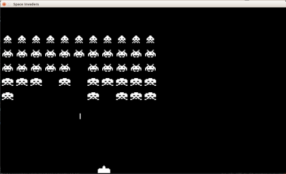
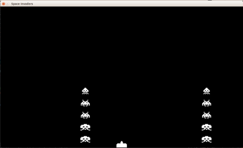
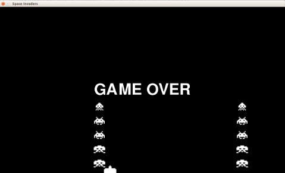

# Invasione

E' ora di ordinare l'invasione. Arriveranno 5 righe ognuna di 11 alieni. Gli alieni saranno di tipo diverso e verranno 
ricostruiti tutti quando li distruggiamo tutti. Se toccano l'astronave o terra vincono e il gioco finisce con una 
scritta **GAME OVER**.

Per fare questo dovremo:

1. Una fila di alieni
2. Due file di alieni dello stesso tipo
3. Le altre tre file di alieni con nuove immagini
4. Ricostruire gli alieni quando sono tutti distrutti
5. Riconoscere quando toccano terra o l'astronave
6. Stamapre Game Over e attendere che il gioco venga chiuso

## Una fila di alieni

Per prima cosa segnamo quanto sono distanti gli alieni lateralmente:

```python
DISTANZA_LATERALE_ALIENO = MOVIMENTO_LATERALE_ALIENO * 2
```

Ora decidiamo dove mettere il primo alieno che si trova a sinistra: dato che sono 11 alieni in ogni riga ci sono 5 spazi
a sinistra prima di trovare il primo. Quindi `posizione_primo_x = larghezza/2 - DISTANZA_LATERALE_ALIENO * 5`

Per fare gli 11 alieni useremo `for numero_alieno in range(11)`.... provate sulla console

```python
>>> for numero_alieno in range(11):
...     print(numero_alieno)
... 
0
1
2
3
4
5
6
7
8
9
10
```

Quindi per fare i nostri alieni usiamo

```python
posizione_primo_x = LARGHEZZA/2 - DISTANZA_LATERALE_ALIENO * 5
posizione_primo_y = 90
for colonna in range(11):
    nuovo_alieno = {}
    nuovo_alieno["immagini"] = pygame.image.load("alieno_1_1.png"), pygame.image.load("alieno_1_2.png")
    nuovo_alieno["rettangolo"] = nuovo_alieno["immagini"][0].get_rect()
    nuovo_alieno["pos_immagine"] = 0
    nuovo_alieno["rettangolo"].center = posizione_primo_x + colonna * DISTANZA_LATERALE_ALIENO, posizione_primo_y
    alieni.append(nuovo_alieno)
```

Ed ecco la prima fila di alieni.

## Due file di alieni

La distanza verticale tra gli alieni è

```python
DISTANZA_GIU_ALIENO = MOVIMENTO_GIU_ALIENO * 4
```

E dobbiamo fare due righe ... il trucco è sempre quello:

```python
for riga in range(2):
    for colonna in range(11):
    ...
    nuovo_alieno["rettangolo"].centerx = posizione_primo_x + colonna * DISTANZA_LATERALE_ALIENO
    nuovo_alieno["rettangolo"].centery = posizione_primo_y + riga * DISTANZA_GIU_ALIENO
```

Ho diviso `center` in due righe separate `centerx` e `centery` dato che facendo i conti risulta più chiaro.

## Ecco tutti gli alieni

Per ogni fila di alieni l'unica cosa che cambia sono le immagini da caricare:

* Riga 0 `"alieno_3_1.png"` e `"alieno_3_2.png"`
* Riga 1 e 2 `"alieno_2_1.png"` e `"alieno_2_2.png"`
* Riga 3 e 4 `"alieno_1_1.png"` e `"alieno_1_2.png"`

Per conservare queste informazioni usiamo un dizzionario dove usiamo il numero di riga per identificare la descrizione
che sono le immagini

```python
immagini_alieni = {}
immagini_alieni[0] = pygame.image.load("alieno_3_1.png"), pygame.image.load("alieno_3_2.png")
immagini_alieni[1] = pygame.image.load("alieno_2_1.png"), pygame.image.load("alieno_2_2.png")
immagini_alieni[2] = pygame.image.load("alieno_2_1.png"), pygame.image.load("alieno_2_2.png")
immagini_alieni[3] = pygame.image.load("alieno_1_1.png"), pygame.image.load("alieno_1_2.png")
immagini_alieni[4] = pygame.image.load("alieno_1_1.png"), pygame.image.load("alieno_1_2.png")
```

Ora dobbiamo solo cambiare il numero totale di righe da `2` a `5` (`for riga in range(5):`) e usare
 
```python
nuovo_alieno["immagini"] = immagini_alieni[riga]
```

Per caricare le immagini.... **Ecco la nostra invasione**



## Ricreare gli alieni

Li alieni sono finiti quando la lista `alieni` diventa vuota. Python per mette semplicemnete di verificare questo con un 
comando del tipo `if not alieni:`. Provate sulla console

```python
>>> alieni = [alieno_1]
>>> if not alieni:
...     print("vuota")
... 
>>> alieni.remove(alieno_1)
>>> if not alieni:
...     print("vuota")
... 
vuota
```

Quindi se **spostiamo** il ciclo dove aggiungiamo gli alieni all'inizio della logica (frntro al ciclo main di `pygame`)
controllando prima se la lista è vuota otteniamo proprio quello che vogliamo. ... 
**SOLO PER PROVARE FATE UN SOLO ALIENO PER RIGA**

```python
while True:
    if not alieni:
        muovi_alieno_giu = 0
        movimento_alieno_dx_sx = MOVIMENTO_LATERALE_ALIENO
        for riga in range(5):
            for colonna in range(1):
```

Ogni volta che ricostruiamo gli alieni dobbiamo dirgli di iniziare a muoversi a destra e non in basso. **Ora potete 
rimettere 11 alieni per riga**

## L'alieno tocca l'astronave o il terreno

Per provare questa cosa facciamo partire gli alieni più in basso e lasciamo solo due alieni uno all'inizio e uno alla 
fine:

```python
posizione_primo_y = 420
...
            for colonna in range(2):
...
                nuovo_alieno["rettangolo"].centerx = posizione_primo_x + colonna * DISTANZA_LATERALE_ALIENO * 10
```

In questa maniera possiamo provare semplicemente quando tocca il terreno o il cannone



Per capire se stiamo toccando il pavimento ci basta verificare se `alieno["rettangolo"].bottom >= altezza` e per
vedere se il cannone e l'aleino si toccano con `alieno["rettangolo"].colliderect(cannone_rettamgolo)` otteniamo quello 
che vogliamo. Quindi:

```python
for alieno in alieni:
    if alieno["rettangolo"].bottom >= altezza or alieno["rettangolo"].colliderect(cannone_rettamgolo):
        print("INVASIONE RIUSCITA")
```

Ora provate a toccare subito un alieno o a farli atterare: leggerete una sfilza di 

```
INVASIONE RIUSCITA
INVASIONE RIUSCITA
INVASIONE RIUSCITA
```

Vogliamo ora che quando riesce l'invasionela scritta sia solo una e smette di muoversi. Per fare questo dobbiamo 
cambiare il ciclo main di `pygame` e usare un nuovo stato `invaso = False`: i ciclo main ora diventa:

```python
invaso = False
while not invaso:
   ...
```

Ora quando riconosciamo l'invasione ci basta sostituire `print("INVASIONE RIUSCITA")` con

```python
invaso = True
```

Ora il gioco esce improvvisamente.

## GAME OVER e attendere che il gioco venga chiuso

Alla fine del ciclo main di `pygame` fermiamo la musica con:

```python
pygame.mixer.music.stop()
```

Costruiamo la scritta con:

```python
font = pygame.font.SysFont(None, 96)
testo = font.render('GAME OVER', 1, BIANCO)
```

... dove `BIANcO` lo abbiamo definito sotto a `NERO` con `BIANCO = 255, 255, 255`

Prendiamo il solito rettangolo e posizioniamolo al centro e disegniamolo:

```python
testo_rettangolo = testo.get_rect()
testo_rettangolo.center = (LARGHEZZA/2, ALTEZZA/2)
schermo.blit(testo, testo_rettangolo)
pygame.display.flip()
```

E iniziamo un semplice ciclo main per aspettare che il gioco venga chiuso:

```python
while True:
    orologio.tick(FPA)
    for evento in pygame.event.get():
        if evento.type == pygame.QUIT:
            sys.exit()
```



Ora possiamo rimettere a posto la formazione con

```python
posizione_primo_y = 30
...
            for colonna in range(11):
...
                nuovo_alieno["rettangolo"].centerx = posizione_primo_x + colonna * DISTANZA_LATERALE_ALIENO
```


## Dove siamo adesso

Ora è quasi [completo](src/invasione.py). Mancano solo gli spari degli alieni, i punti e alcuni dettagli.

* Prossimo: [Conteggio punti e alieni che sparano](punti_spari.md)
* Precedente: [Colpisci l'alieno e preparati all'invasione con due alieni](alieno_colpito.md)