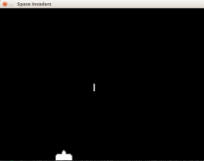

# Muoviamo e Spariamo

Quello che dobbiamo fare quì è spostare l'astronave non le frecce destra e sinistra. Inoltre quando si preme la barra 
un bello sparo partirà dalla nostra astronave per muoversi fino alla fine della finestra.

## Muovere il cannone

Ora cerchiamo solo di muovere il cannone senza doverlo controllare con i tasti. Ammettiamo solo di sapere che 
`muovi_destra` è vero e facciamo muovere il cannone.

```python
if muovi_destra:
    cannone_rettamgolo.centerx = cannone_rettamgolo.centerx + 5
```
Se fate questo a ogni colpo di bacchetta (frame) e all'inizio del programma aggiungete

```
muovi_destra = True
```

Vedrete il vostro cannone muoversi a destra e scomparire dallo schermo... si **scomparire**. Per evitare che non 
scompaia dobbiamo verificare che la parte destra del rettangolo non vada oltre alle dimensioni dello schermo:

```python
if cannone_rettamgolo.right > larghezza:
    cannone_rettamgolo.right = larghezza
```

Per il movimento a sinistra fate la stessa cosa usando `muovi_sinistra` e togliendo `5` a `centerx` invece di 
aumentarlo. Potete anche chiamare `VELOCITA = 5` e usare `VELOCITA`. **ATTENZIONE** Non è più la destra che esce dallo 
scermo ma la sinistra e uscire vuol dire diventare m inore di 0.

Dovreste avere circa questo codice

```python
if muovi_destra:
    cannone_rettamgolo.centerx = cannone_rettamgolo.centerx + VELOCITA
if muovi_sinistra:
    cannone_rettamgolo.centerx = cannone_rettamgolo.centerx - VELOCITA
if cannone_rettamgolo.right > larghezza:
    cannone_rettamgolo.right = larghezza
if cannone_rettamgolo.left < 0:
    cannone_rettamgolo.left = 0
```

### Muovere il cannone ... con i tasti

Concentrimoci solo sulla freccia a destra. Dobbiamo catturare l'evento tasto freccia destra e quindi dire che quando
si preme diventa vero `muovi_destra`, mentre quando si lascia diventa falso.

Ogni evento è di un certo tipo (`type`), la pressione o il rilascio dei tasti sono eventi del tipo `pygame.KEYDOWN` 
*Pressione* e `pygame.KEYUP` *Rilascio*.

Una volta scoperto se l'evento che stiamo guardando è di tipo *Pressione* o *Rilascio* possiamo vedere quale bottone è
usando il campo `key` di event.

Prima di scrivere il programma che muove facciamone uno che quando si preme la ferccia a destra stampa la scritta 
`"FRECCIA DESTRA"` con `print`: quando guardiamo gli eventi con `for evento in pygame.event.get()` dobbiamo aggiungere 
le seguenti righe:

```python
if evento.type == pygame.KEYDOWN:
    print(evento.key)
    if evento.key == pygame.K_RIGHT:
        print("FRECCIA DESTRA")
```

Provate ora il vostro gioco e scoprirete guardando in basso che :

* Viene scritto un numero tutte le volte che premete un tasto
* Quando premete la freccia destra stampa `FRECCIA DESTRA`
* Se tenete premuto il tasto non viene ripetuto niente

Fortunatamente qualcuno ha tradotto i numeri in manira facile da scrivere nel programma: `pygame.K_RIGHT` è proprio 
`275`... verificate sulla console

```python
>>> import pygame
>>> pygame.K_RIGHT
275
```

Quindi ci basta che quando si preme `pygame.K_RIGHT` `muovi_destra` diventa vero, quando si rilascia `muovi_destra`
diventa falso:

```python
if evento.type == pygame.KEYDOWN:
    if evento.key == pygame.K_RIGHT:
        muovi_destra = True
if evento.type == pygame.KEYUP:
    if evento.key == pygame.K_RIGHT:
        muovi_destra = False
```

Provate e il movimento a destra è fatto!

Per quello a sinistra vi basta usare `pygame.K_LEFT` per modificare `muovi_sinistra`

## Lo Sparo

Lo sparo parte dal centro del cannone e si muove verso l'alto con una certa velocità che chimeremo 
`VELOCITA_SPARO = 10`. Quando esce fuori dallo schermo sparisce (non viene più disegnato). Ci può essere solo uno sparo 
alla volta. Prima di collegare lo sparo alla barra della tastiera facciamo che lo sparo parte subito e quando sparisce 
riparte.

Dobbiamo quindi caricare l'immagine dello sparo, fare un rettangolo dello sparo e definire quando parte uno sparo e 
quando lo sparo sta volando per muoverlo: tutto questo è l'inizializzazione dello sparo.

```python
sparo_immagine = pygame.image.load("sparo.png")
sparo_rettamgolo = sparo_immagine.get_rect()
spara = False
sparo_in_volo = False
```

Per disegnarlo dobbiamo fare come per il cannone, solo che lo sparo lo disegnamo solo se `sparo_in_volo` è vero. Quindi
dopo il disegno del cannone aggiungiamo

```python
if sparo_in_volo:
    schermo.blit(sparo_immagine, sparo_rettamgolo)
```

Per muoverlo facciamo come il cannone, solo che adesso quando supera il limite diciamo che non è più `sparo_in_volo` e 
per provare come partono gli spari facciamo diventare vero `spara`:

```python
if sparo_in_volo:
    sparo_rettamgolo.top = sparo_rettamgolo.top - VELOCITA_SPARO
if sparo_rettamgolo.bottom < 0:
    sparo_in_volo = False
    spara = True
```

Infine quando `spara` è vero bisogna posizionare lo il rettangolo dello al centro del cannone dentro la punta, dire che
`sparo_in_volo` deiventa vero e dire che `sparo` ora è falso.

```python
if spara:
    sparo_rettamgolo.top = cannone_rettamgolo.top
    sparo_rettamgolo.centerx = cannone_rettamgolo.centerx
    spara = False
    sparo_in_volo = True
```

Se avete messe tutto al posto giusto potete provare ... ma fini a che non inizalizzate `spara` a `True` non succederà 
niente, provate a metterlo e vedrete i vostri spari volare.

### Lo sparo parte quando vogliamo noi

Ora ci basta guardare l'evento della tasto abbassato per la barra `pygame.K_SPACE`, se lo sparo non è in volo allora 
`spara` deve diventare vero... ricordiamoci di togliere l'inizzializzazione di `spara` a `True` e la ripartenza 
automatica quando sparisce.

```python
if evento.key == pygame.K_SPACE:
    if not sparo_in_volo:
        spara = True
```

Ora così fa quello che deve fare solo che `spara` non serve più a molto, potete lasciarla, ma io l'ho rimossa mettendo
nell'evento il lavoro che facevo quando spara è vero. Se preferite toglietelo come ho fatto io, ma se non vi da fastidio 
lasciatelo pure.

## Dove siamo adesso



La mia versione è [questa](src/muovi.py) ma la vostra può essere anche un po diversa. Muoviamo il cannone e lanciamo 
spari inizia a sembrare divertente.

* Prossimo: [Un Alieno](alieno.md)
* Precedente: [Sfondo, musica e il nostro cannone](inizio.md)