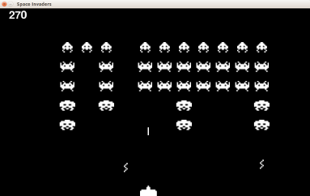

# Conteggio punti e alieni che sparano

Ci occupiamo adesso di contare i punti, far sparare gli alieni e accelerare il movimento degli alieni ogni volta che
vengono ricostruiti.

## Contare i punti

Ogni tipo di alieno vale diversamente:

* Quelli più in alto valgono di più: ben 40 punti
* Quelli in mezzo 20 punti
* Quelli in basso 10 punti

Questi punti sembrano un attributo degli alieni e quindi un nuovo campo nel dizzionario di ogni alieno. Come per le
immagini immagazziniamo questa informazione suddividendola per riga. Questa volta possiamo scrivere il dizzionario
direttamente dato che i campi sono semplici:

```python
punti_alieni = {0: 40, 1: 20, 2: 20, 3: 10, 4: 10}
```

Ora tutte le volte che creiamo un alieno dobbiamo indicare anche quanti punti vale con 

```python
nuovo_alieno["punti"] = punti_alieni[riga]
```

Adesso iniziamo impostando `punti = 0` nella inizializzazione e ogni volta che un alieno viene colpito sommiamo i punti 
che vale proprio sotto a `alieni.remove(alieno)`

```python
punti = 0
...
punti = punti + alieno["punti"]
```

Ora per verificare se tutto funziona ogni volta che aumentiamo i punti scriviamo:

```python
print("PUNTI :" + str(punti))
```

Ci manca solo di scrivere i punti in alto a sinistra. Nella zona dei disegni, prima di `pygame.display.flip()`,
disegniamo i punti con

```python
    font = pygame.font.SysFont(None, 48)
    testo_punti = font.render(str(punti), 1, BIANCO)
    punti_rettangolo = testo_punti.get_rect()
    punti_rettangolo.topleft = 30, 5
    schermo.blit(testo_punti, punti_rettangolo)
```

e togliamo la vecchio `print("PUNTI :" + str(punti))` che non serve più.

## Gli spari degli alieni

Gli spari degli alieni partono a caso. Quindi gli spari possono essere tanti (una lista come gli alieni) e sono 
fatti di due immagini (come gli alieni). A differenza degli alieni tra i diversi spari cambia solo il rettangolo e 
quindi mettiamo solo quello nella lista.

Per provare gli spari invece di farli creare a caso usiamo un bottone: la lettera **A**.
 
Andiamo con ordine. Ci servono:

1. `VELOCITA_SPARO_ALIENO = 10` che mettiamo trale costanti
2. Fare la lista di spari, caricare le immagini dello sparo e fissare il numero dell'immagine da mostrare 
(inizializzazione)
3. Far partire lo sparo (aggiungere un rettangolo alla lista) quando si preme il tasto **A** e posizionarlo su un alieno
(eventi)
4. A ogni frame alternare le immagini da disegnare (logica)
5. A ogni frame muovere tutti gli spari e verificare quelli da rimuovere o che colpiscono il cannone (logica)
6. Disegnare gli spari (disegno)

### 2 Fare la lista di spari, caricare le immagini dello sparo e fissare il numero dell'immagine da mostrare

Nella parte di inizzializzazione:

```python
spari = []
immagini_sparo_alieno = pygame.image.load("sparo_alieno_1.png"), pygame.image.load("sparo_alieno_2.png")
sparo_alieno_pos = 0
```

### 3 Far partire lo sparo quando si preme il tasto **A** e posizionarlo

In alto, prima delle costanti e dove ci sono altri `import`

```python
import random
```

Zona inizializzazione

```python
nuovo_sparo_alieno = False
```

Nella gestione degli eventi dentro `if evento.type == pygame.KEYDOWN:`

```python
if evento.key == ord("a"):
    nuovo_sparo_alieno = True
```

Inizio delle logica

```python
if nuovo_sparo_alieno:
    nuovo_sparo_alieno = False
    rettangolo_nuovo_sparo_alieno = immagini_sparo_alieno[0].get_rect()
    alieno_che_spara = random.choice(alieni)
    rettangolo_nuovo_sparo_alieno.midbottom = alieno_che_spara["rettangolo"].midbottom
    spari.append(rettangolo_nuovo_sparo_alieno)
```

### 4 Alternare le immagini da disegnare
    
In fondo alla logica e prima di disegnare

```python
sparo_alieno_pos = sparo_alieno_pos + 1
if sparo_alieno_pos > 1:
    sparo_alieno_pos = 0
```

### 5 muovere tutti gli spari e verificare quelli da rimuovere

Nella logica

```python
for sparo_alieno in spari:
    if sparo_alieno.top > altezza:
        spari.remove(sparo_alieno)
    if sparo_alieno.colliderect(cannone_rettangolo):
        spari.remove(sparo_alieno)
        print("CANNONE COLPITO")
    sparo_alieno.bottom = sparo_alieno.bottom + VELOCITA_SPARO_ALIENO
```

### 6 Disegnare gli spari

Dove disegnamo

```python
for sparo_alieno in spari:
    schermo.blit(immagini_sparo_alieno[sparo_alieno_pos], sparo_alieno)
```


Ora cambiamo lo sparo creato con il bottone **A** con un evento casuale. Per fare questo definiamo un nuovo evento come 
abbiamo fatto per il movimento degli alieni solo che cambiamo l'intervallo ogni volta con un numero casuale:

```python
SPARO_ALIENO_EVENTO = pygame.USEREVENT + 2
FREQUENZA_SPARI_ALIENI_MILLISECONDI = 2300
...
pygame.time.set_timer(SPARO_ALIENO_EVENTO, random.randint(1, FREQUENZA_SPARI_ALIENI_MILLISECONDI))
...
if evento.type == SPARO_ALIENO_EVENTO:
    nuovo_sparo_alieno = True
    pygame.time.set_timer(SPARO_ALIENO_EVENTO, random.randint(1, FREQUENZA_SPARI_ALIENI_MILLISECONDI))
```

Dove il primo pezzo va tra le costanti, il secondo dove nell'inizializzazione, 
`if evento.type == SPARO_ALIENO_EVENTO` negli eventi sostituisce/aggiunto alla verifica del tasto **A** e il nuovo timer 
dopo aver aggiunto lo sparo.

## Accelerare gli alieni

Per accelerare gli alieni è sufficiente diminuire il tempo con il quale viene creato l'evento di movimento:

```python
BASE_FREQUENZA_MOVIMENTO_ALIENI_MILLISECONDI = 1000
...
frequenza_movimento_alieni = BASE_FREQUENZA_MOVIMENTO_ALIENI_MILLISECONDI
...
frequenza_movimento_alieni = int(frequenza_movimento_alieni / 4) * 3
pygame.time.set_timer(MUOVI_ALIENI_EVENTO, frequenza_movimento_alieni)
```

La prima riga va messa tra le costanti, la seconda nell'inizializzazione e l'ultimo blocco tutte le volte che 
ricostruiamo gli alieni (inizio della logica).

## Dove siamo adesso



Ci siamo [quasi](src/punti_spari.py). Facciamo scoppiare il cannone quando è colpito e limitiamo i cannoni.

* Prossimo: [Solo 3 cannoni](3_cannoni.md)
* Precedente: [L'invasione](invasione.md)